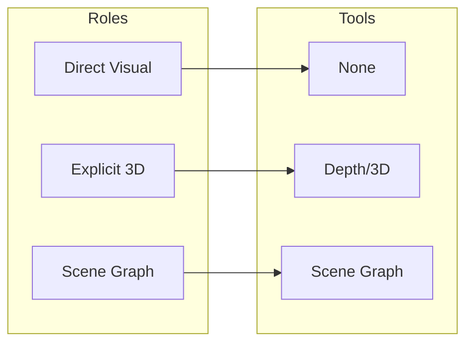
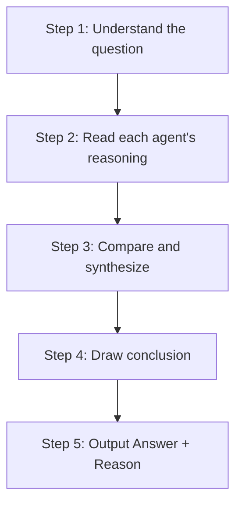

# [Appendix] Spatial MAS Prompt Design and Tool Architecture

> **Paper Appendix.** Complete prompt templates, tool output formats, design rationale, and visual documentation for the Spatial Multi-Agent System.

---

## 1. Architecture Overview

Spatial MAS is designed for **diverse spatial reasoning problems** across benchmarks and real-world scenarios. The architecture is grounded in **spatial cognition research** (Kosslyn 1987, Walsh 2003, Levinson 2003).

### 1.1 Pipeline Diagram (Image)

---

## 2. Model Profiles Heatmap

Agent profiles are derived from 3DSRBench and CV-Bench performance. The Head Agent uses these profiles for model selection when `category_seen=false`. Each cell shows per-category performance (0–1).

### 2.1 Model × Category Summary Table

| Model | Best Category | depth | distance | relation | orientation | count |
|-------|---------------|-------|----------|----------|-------------|-------|
| Claude 4.5 | relation (0.85) | 0.64 | 0.70 | **0.85** | 0.61 | 0.64 |
| GPT-4o | relation (0.75) | 0.58 | 0.68 | **0.75** | 0.57 | 0.58 |
| Qwen3-4B | distance (0.74) | 0.58 | **0.74** | 0.72 | 0.53 | 0.58 |
| Gemini-ER | relation (0.59) | 0.46 | 0.32 | **0.59** | 0.47 | 0.46 |
| LLaVA-4D | relation (0.53) | 0.30 | 0.10 | **0.53** | 0.32 | 0.30 |
| Sa2VA | orientation (0.22) | 0.20 | 0.21 | 0.08 | **0.22** | 0.20 |

---

## 3. Specialist Role × Tool Assignment

### 3.1 Role–Tool Matrix (Image)

| Role | Tool | Information Type |
|------|------|-------------------|
| **direct_visual_heuristic** | None | Pictorial cues (occlusion, size, height) |
| **explicit_3d_representation** | Depth, 3D Repr | Object z-values, depth ordering |
| **scene_graph_construction** | Scene Graph | Nodes + edges (above, below, left_of, right_of) |

---

## 4. Head Agent

### 4.1 Category Taxonomy (5 Unified Categories)

| Category | Definition |
|----------|------------|
| **spatial_relation** | Above/below, next to, between. Asks WHERE. |
| **distance_depth** | How far from camera or between objects. Asks HOW FAR. |
| **size** | Size/height comparison. Asks HOW BIG. |
| **orientation** | Facing direction, alignment. Asks WHICH WAY. |
| **counting** | Number of instances. Asks HOW MANY. |

### 4.2 Design Rationale

- **Single responsibility**: Only category classification.
- **Classification rules**: Explicit mapping (e.g., "how many" → counting).
- **Examples**: Fix output format for reliable parsing.

---

## 5. Specialist Agents

### 5.1 direct_visual_heuristic

- **Strategy**: Pictorial cues (occlusion, relative size, height in image).
- **Tool**: None.
- **Protocols**: Count Protocol (unit definition, systematic scan, occlusion rule) | Spatial Protocol (Decompose → Reference object → Cues + Resolve).

### 5.2 explicit_3d_representation

- **Strategy**: Object-level 3D depth (z-values, depth ordering).
- **Tool**: `get_3d_representation()` — DepthAnything + OWL-ViT/DETR.
- **Output**: Depth Map Grid, Object z-values, Depth Ordering, Instance Count.

### 5.3 scene_graph_construction

- **Strategy**: 2D relation graph (nodes + edges).
- **Tool**: `get_scene_graph()` — DETR/OWL-ViT → pairwise relations.
- **Relations**: above, below, left_of, right_of, overlaps.

---

## 6. Final Reasoning Agent

### 6.1 5-Step Protocol (Mermaid)

### 6.2 Protocol Diagram (Image)

### 6.3 Design Principles

| Principle | Description |
|-----------|-------------|
| **Strategy–question matching** | Depth questions → explicit_3d; relation questions → scene_graph. |
| **No blind majority** | Prefer the most grounded reasoning, not the majority vote. |
| **5-step protocol** | Understand → Read → Compare → Conclusion → Output. |

---

## 7. Full Prompt Templates & Tool Examples

See **[APPENDIX_PROMPTS_AND_TOOLS_FULL.md](https://github.com/CY-H1329/Spatial_MAS/blob/main/docs/APPENDIX_PROMPTS_AND_TOOLS_FULL.md)** for:

- Complete Head Agent prompt
- Complete Specialist prompts (all 3 roles)
- 3D Representation tool output example
- Scene Graph tool output example
- Final Reasoning prompt
- SharedMemory example
- Output format blocks (multiple_choice, free_form)

---

## 8. Tool Reference Summary

| Tool | Function | Model / Source |
|------|----------|----------------|
| Depth (legacy) | `get_depth_summary()` | LiheYoung/depth-anything-small-hf |
| 3D Representation | `get_3d_representation()` | DepthAnything + OWL-ViT / DETR |
| Scene Graph | `get_scene_graph()` | DETR (facebook/detr-resnet-50) / OWL-ViT |

**C-Hybrid**: Tools are pre-computed by the pipeline and injected into the prompt. No dynamic tool-calling by agents.

---

## References

- **Code**: `src2/agents/mas_v2/prompts.py`, `src2/tools/`
- **Docs**: [TOOL_ARCHITECTURE.md](https://github.com/CY-H1329/Spatial_MAS/blob/main/docs/TOOL_ARCHITECTURE.md), [MAS_V2_FLOW.md](https://github.com/CY-H1329/Spatial_MAS/blob/main/docs/MAS_V2_FLOW.md)
