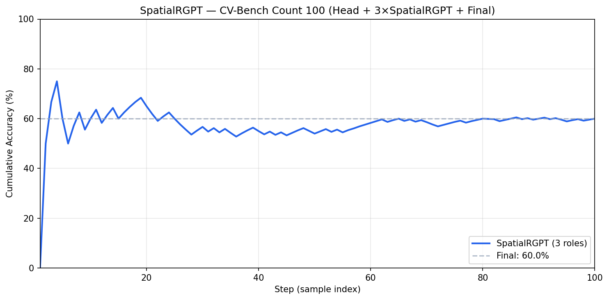

# [SpatialRGPT] axhub.vaiv.kr — CV-Bench Count 100 파이프라인 평가

## Summary

**Head (Qwen3-VL-4B) + Specialist 3 roles 전부 SpatialRGPT + Final (Qwen3-VL-8B)** 파이프라인으로 CV-Bench **Count 카테고리 100개** 평가. axhub.vaiv.kr (JupyterHub) 환경에서 실행.

| 항목 | 값 |
|------|-----|
| **최종 Accuracy** | **60/100 = 60.0%** |
| Specialist | SpatialRGPT (3 roles 고정) |
| Benchmark | CV-Bench, Count only |
| Samples | 100 |
| Environment | axhub.vaiv.kr, conda srgpt_axhub |

---

## 파이프라인 구조

```
[이미지 + 질문]
      │
      ▼
┌─────────────────┐
│  Head Agent     │  Qwen3-VL-4B (Count 전용 → force_category="counting" 생략)
└────────┬────────┘
         │
         ▼
┌─────────────────┐
│  Specialist 1   │  SpatialRGPT (direct_visual_heuristic)
│  Specialist 2   │  SpatialRGPT (explicit_3d_representation)
│  Specialist 3   │  SpatialRGPT (scene_graph_construction)
└────────┬────────┘
         │
         ▼
┌─────────────────┐
│  Final Reasoner │  Qwen3-VL-8B (SharedMemory + query → 최종 답)
└────────┬────────┘
         │
         ▼
    [Accuracy: 60.0%]
```

---

## Step-by-Step Accuracy 그래프



- **X축**: Step (1..100)
- **Y축**: Cumulative Accuracy (%)
- **최종**: 60.0%

---

## axhub.vaiv.kr 환경 설정 (상세)

### Step 1: 가상환경 생성

```bash
conda create -n srgpt_axhub python=3.10 -y
```

### Step 2: 가상환경 활성화

```bash
conda activate srgpt_axhub
```

### Step 3: 프로젝트 클론

```bash
cd ~
git clone https://github.com/CY-H1329/Spatial_MAS.git
cd Spatial_MAS
```

### Step 4: SpatialRGPT 클론

```bash
git clone https://github.com/AnjieCheng/SpatialRGPT SpatialRGPT
```

### Step 5: 환경설정 (pip install)

```bash
cd /home/jovyan/CY/Spatial_MAS   # 실제 경로로 수정
bash scripts/setup_axhub_srgpt_env.sh
```

> `setup_axhub_srgpt_env.sh`는 PyTorch 2.4, transformers 4.51+, deepspeed, pycocotools 등 설치.

### Step 6: 실행

```bash
export SPATIALRGPT_PATH=/home/jovyan/CY/Spatial_MAS/SpatialRGPT
python test_fixed_specialist_mas_v2.py \
  --specialist spatial_rgpt \
  --benchmark cvbench \
  --category_filter Count \
  --max_samples 100 \
  --device cuda
```

### Step 7: Step Accuracy 저장 (그래프용)

```bash
export SPATIALRGPT_PATH=/home/jovyan/CY/Spatial_MAS/SpatialRGPT
python test_fixed_specialist_mas_v2.py \
  --specialist spatial_rgpt \
  --benchmark cvbench \
  --category_filter Count \
  --max_samples 100 \
  --device cuda \
  --save_step_acc results/srgpt_count100_step_acc.json
```

### Step 8: 그래프 생성

```bash
python scripts/plot_srgpt_cvbench_count100_step_accuracy.py \
  --input results/srgpt_count100_step_acc.json \
  --output docs/fig_srgpt_cvbench_count100_accuracy.png
```

---

## Jupyter 노트북 실행

`notebooks/axhub_srgpt_cvbench_count.ipynb` 사용:

```python
# Cell 1: 경로 설정
import os, sys
from pathlib import Path
PROJECT_ROOT = Path("/home/jovyan/CY/Spatial_MAS")  # axhub 경로
os.chdir(PROJECT_ROOT)
sys.path.insert(0, str(PROJECT_ROOT))
os.environ["SPATIALRGPT_PATH"] = str(PROJECT_ROOT / "SpatialRGPT")

# Cell 2: 모델 로드
from test_fixed_specialist_mas_v2 import build_runners_fixed, run_fixed_specialist_mas_test
head_gen, spec_gen, reason_gen = build_runners_fixed(
    specialist="spatial_rgpt", specialist_device="cuda", use_vlm_reasoning=True,
)

# Cell 3: 100개 평가
results = run_fixed_specialist_mas_test(
    head_gen, spec_gen, reason_gen,
    specialist="spatial_rgpt", benchmark="cvbench",
    max_samples=100, category_filter=["Count"],
)
print(f"Accuracy: {results['correct']}/{results['total']} = {100*results['accuracy']:.1f}%")
```

---

## 결과 요약

| Metric | Value |
|--------|-------|
| Correct | 60 |
| Total | 100 |
| **Accuracy** | **60.0%** |
| Category | counting (Count only) |
| Assignments | 3 roles 모두 spatial_rgpt |

---

## 참고: 호환성 패치

axhub 환경에서 transformers 5.x, PyTorch 2.4와 SpatialRGPT 호환을 위해 `src2/models/spatial_rgpt.py`에 다음 패치 적용:

- `is_tf_available` (transformers 5.x)
- `is_torch_fx_available` (transformers 5.x)
- `is_flash_attn_2_available` → False (flash_attn ABI 불일치 시 SDPA 폴백)
- `all_tied_weights_keys` (MultimodalProjector)
- `no_init_weights` (transformers 4.40+)
